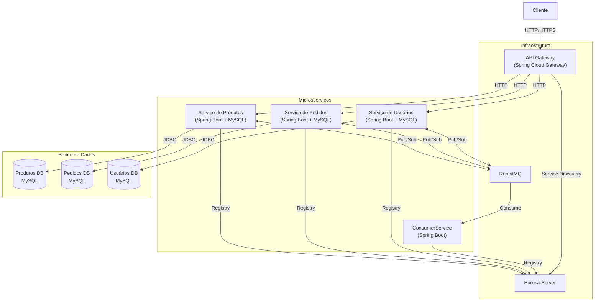

# Diagrama de Arquitetura - Event Driven Architecture (EDA) utilizando RabbitMQ



- Executar o docker compose: docker-compose up

## Exemplos de Chamadas para os Endpoints

Aqui estão exemplos de como chamar os endpoints dos serviços que implementamos, organizados na ordem Cliente, Produto e Pedido. Certifique-se de que os serviços estejam em execução antes de testar estas chamadas.

### Serviço de Clientes

1. Criar um novo cliente:
   ```bash
   curl -X POST http://localhost:8080/customers \
   -H "Content-Type: application/json" \
   -d '{
     "name": "João Silva",
     "email": "joao.silva@email.com",
     "password": "senha123"
   }'
   ```

2. Obter todos os clientes:
   ```bash
   curl http://localhost:8080/customers
   ```

3. Obter um cliente específico (substitua {id} pelo ID real do cliente):
   ```bash
   curl http://localhost:8080/customers/{id}
   ```

4. Atualizar um cliente (substitua {id} pelo ID real do cliente):
   ```bash
   curl -X PUT http://localhost:8080/customers/{id} \
   -H "Content-Type: application/json" \
   -d '{
     "name": "João Silva Jr.",
     "email": "joao.silva.jr@email.com"
   }'
   ```

5. Deletar um cliente (substitua {id} pelo ID real do cliente):
   ```bash
   curl -X DELETE http://localhost:8080/customers/{id}
   ```

### Serviço de Produtos

1. Criar um novo produto:
   ```bash
   curl -X POST http://localhost:8080/products \
   -H "Content-Type: application/json" \
   -d '{
     "name": "Smartphone XYZ",
     "description": "Último modelo com câmera de alta resolução",
     "price": 999.99,
     "stock": 100
   }'
   ```

2. Obter todos os produtos:
   ```bash
   curl http://localhost:8080/products
   ```

3. Obter um produto específico (substitua {id} pelo ID real do produto):
   ```bash
   curl http://localhost:8080/products/{id}
   ```

4. Atualizar um produto (substitua {id} pelo ID real do produto):
   ```bash
   curl -X PUT http://localhost:8080/products/{id} \
   -H "Content-Type: application/json" \
   -d '{
     "name": "Smartphone XYZ - Edição Especial",
     "description": "Versão atualizada com mais memória",
     "price": 1099.99,
     "stock": 50
   }'
   ```

5. Deletar um produto (substitua {id} pelo ID real do produto):
   ```bash
   curl -X DELETE http://localhost:8080/products/{id}
   ```

6. Atualizar o estoque de um produto (substitua {id} pelo ID real do produto):
   ```bash
   curl -X PATCH http://localhost:8080/products/{id}/stock?quantity=20
   ```

### Serviço de Pedidos

1. Criar um novo pedido:
   ```bash
   curl -X POST http://localhost:8080/orders \
   -H "Content-Type: application/json" \
   -d '{
     "customerId": 1,
     "items": [
       {
         "productId": 1,
         "quantity": 2,
         "price": 999.99
       }
     ],
     "totalAmount": 1999.98
   }'
   ```

2. Obter todos os pedidos:
   ```bash
   curl http://localhost:8080/orders
   ```

3. Obter um pedido específico (substitua {id} pelo ID real do pedido):
   ```bash
   curl http://localhost:8080/orders/{id}
   ```

4. Atualizar o status de um pedido (substitua {id} pelo ID real do pedido):
   ```bash
   curl -X PATCH http://localhost:8080/orders/{id}/status?status=CONFIRMED
   ```

Lembre-se de que essas chamadas estão sendo feitas através do API Gateway na porta 8080. O gateway redireciona as requisições para os serviços apropriados com base no path da URL.

Ao testar essas chamadas, você deve ver as respostas dos serviços e, nos logs, poderá observar os eventos sendo publicados no Kafka. Isso demonstra como a arquitetura orientada a eventos está funcionando em nosso sistema.

### Fluxo de Teste Recomendado

Para testar o sistema de forma mais realista, você pode seguir este fluxo:

1. Crie um cliente usando o endpoint do Serviço de Clientes.
2. Crie alguns produtos usando o endpoint do Serviço de Produtos.
3. Crie um pedido para o cliente criado, incluindo os produtos criados, usando o endpoint do Serviço de Pedidos.
4. Atualize o status do pedido para "CONFIRMED".
5. Verifique se o estoque dos produtos foi atualizado adequadamente.

Este fluxo simula um cenário típico de e-commerce e permite que você observe como os diferentes serviços interagem entre si através dos eventos publicados no Kafka.
=======
# eda-spring-boot-rabbitmq-graalvm
Event Driven Architecture using Spring Boot, RabbitMQ and GraalVM
